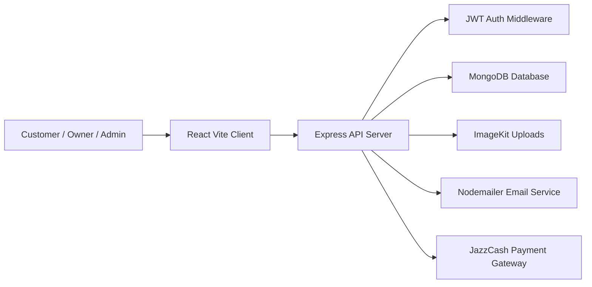
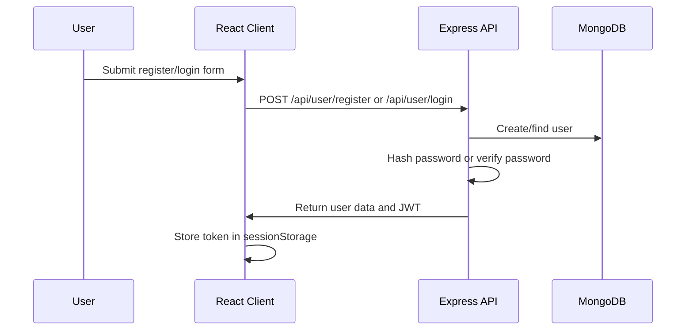
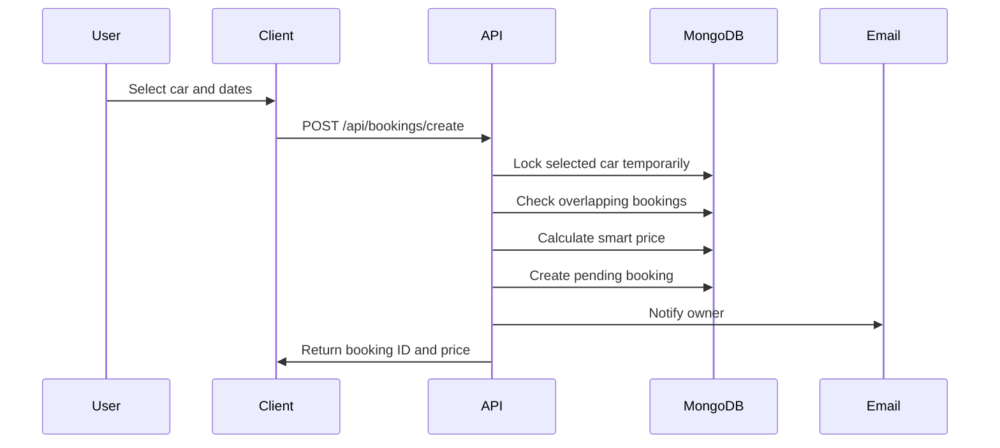
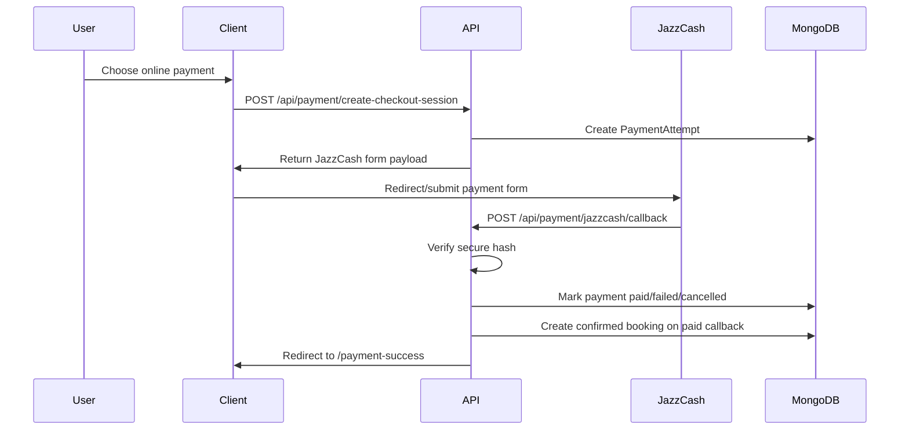
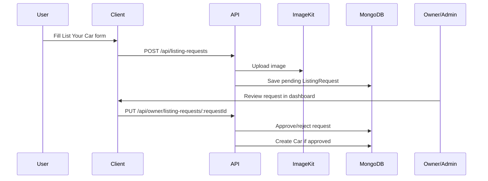

# Smart Car Rental System - Project Documentation

## 1. Project Summary

The Smart Car Rental System is a full-stack MERN-style web application for renting cars online. It provides a customer-facing website for browsing, filtering, booking, paying for, and tracking car rentals, plus an owner/admin dashboard for managing cars, bookings, listing requests, support tickets, FAQs, users, profile information, live tracking, and overdue bookings.

The project is divided into two main applications:

- `client/`: React + Vite frontend.
- `server/`: Node.js + Express + MongoDB backend API.

## 2. Main Objectives

- Replace manual car rental workflows with a digital booking platform.
- Allow customers to search cars by location, price, category, fuel type, and transmission.
- Allow registered users to create bookings and view booking history.
- Support secure authentication with JWT tokens and role-based access control.
- Give owners/admins a dashboard to manage cars, bookings, users, listing requests, support tickets, FAQs, and live tracking.
- Support online payments through JazzCash.
- Support email notifications for bookings, listing requests, support tickets, and password reset.
- Provide chatbot assistance and issue-reporting support.

## 3. User Roles

### Guest

Guests can visit public pages, browse cars, view car details, submit feedback, subscribe to the newsletter, and use basic chatbot answers.

### User

Users can register, log in, book cars, pay online, view their bookings, cancel pending bookings, submit support tickets, reply to their tickets, and submit a request to list their own car.

### Owner

Owners can access the owner dashboard, add/manage cars, view and update bookings, approve/reject listing requests, manage support tickets, update their profile, see dashboard statistics, manage FAQs, and track active bookings.

### Admin

Admins have owner-level access plus admin-only user management and role-change controls.

## 4. Technology Stack

### Frontend

- React 19
- Vite 7
- React Router DOM 7
- Tailwind CSS 4
- Axios
- React Hot Toast
- Recharts
- jsPDF and jsPDF AutoTable for PDF generation

### Backend

- Node.js
- Express 5
- MongoDB
- Mongoose
- JWT authentication
- bcrypt password hashing
- Multer file upload
- ImageKit image storage
- Nodemailer email service
- JazzCash payment integration

## 5. Folder Structure

```text
smart car rental system/
  client/
    src/
      assets/
      components/
      components/owner/
      context/
      pages/
      pages/owner/
      utils/
      App.jsx
      main.jsx
      index.css
    package.json
    vite.config.js
    vercel.json

  server/
    api/
    configs/
    controllers/
    middleware/
    models/
    routes/
    utils/
    app.js
    server.js
    seedFaqs.js
    package.json
    vercel.json

  THESIS_DOCUMENTATION.md
  SMART_CAR_RENTAL_PROJECT_DOCUMENTATION.md
```

## 6. System Architecture



### Frontend Architecture

The frontend uses React routes defined in `client/src/App.jsx`. Public pages are shown with the regular navbar, chatbot, and footer. Owner dashboard pages are shown inside `client/src/pages/owner/Layout.jsx`.

Important frontend files:

- `client/src/App.jsx`: Main routing and role-based owner route protection.
- `client/src/context/AppContext.jsx`: Global application state and API setup.
- `client/src/context/contextStore.js`: Context access helper.
- `client/src/components/ChatbotRestored.jsx`: Chatbot UI used by the app.
- `client/src/components/Navbar.jsx`: Public navigation and login entry points.
- `client/src/pages/Cars.jsx`: Car listing and filtering page.
- `client/src/pages/CarDetails.jsx`: Car details and booking flow.
- `client/src/pages/MyBookings.jsx`: User booking history and cancellation.
- `client/src/pages/ListYourCar.jsx`: User car listing request form.
- `client/src/pages/BookingConfirmation.jsx`: Booking/payment confirmation flow.
- `client/src/pages/PaymentSuccess.jsx`: Payment result page.
- `client/src/pages/owner/*`: Owner/admin dashboard pages.
- `client/src/utils/generateBookingPDF.js`: Booking report PDF generation.
- `client/src/utils/generateLiveTrackingPDF.js`: Live tracking PDF generation.

### Backend Architecture

The backend starts from `server/server.js`, which imports `server/app.js`, starts the Express server, and starts the overdue booking cron process.

Important backend files:

- `server/app.js`: Express setup, CORS, JSON parsing, database connection, and API route mounting.
- `server/server.js`: Server listener and overdue cron startup.
- `server/configs/db.js`: MongoDB connection.
- `server/configs/emailService.js`: Email notification helpers.
- `server/configs/imageKit.js`: ImageKit configuration.
- `server/middleware/auth.js`: JWT verification and role guards.
- `server/middleware/multer.js`: File upload middleware.
- `server/models/*`: MongoDB schemas.
- `server/routes/*`: API endpoint definitions.
- `server/controllers/*`: Business logic.
- `server/utils/bookingLock.js`: Temporary lock to reduce double-booking race conditions.
- `server/utils/bookingPricing.js`: Smart pricing and loyalty discount logic.
- `server/utils/jazzcash.js`: JazzCash payload, hash, and date helpers.

## 7. Frontend Routes

| Path | Page | Purpose |
| --- | --- | --- |
| `/` | `Home` | Landing/home page with featured cars and sections |
| `/cars` | `Cars` | Browse and filter available cars |
| `/car-details/:id` | `CarDetails` | View car details and select booking dates |
| `/my-bookings` | `MyBookings` | User booking history |
| `/booking-confirmation` | `BookingConfirmation` | Booking confirmation and payment choice |
| `/payment-success` | `PaymentSuccess` | JazzCash result handling |
| `/list-your-car` | `ListYourCar` | Submit a car listing request |
| `/owner` | `Dashboard` | Owner/admin dashboard home |
| `/owner/add-car` | `AddCar` | Add a car directly |
| `/owner/manage-cars` | `ManageCars` | Update car availability/delete cars |
| `/owner/manage-bookings` | `ManageBookings` | Confirm/cancel bookings |
| `/owner/live-tracking` | `LiveTracking` | Track active confirmed bookings |
| `/owner/manage-listing-cars` | `ListingRequests` | Approve/reject car listing requests |
| `/owner/manage-faqs` | `AdminFaq` | Manage chatbot FAQ answers |
| `/owner/profile` | `Profile` | Owner profile and image update |
| `/owner/manage-users` | `ManageUsers` | Admin-only user management |
| `/owner/support-tickets` | `SupportTickets` | View/reply/resolve support tickets |
| `/owner/overdue-bookings` | `OverdueBookings` | View and trigger overdue checks |

## 8. Backend API Overview

### User API - `/api/user`

| Method | Endpoint | Access | Purpose |
| --- | --- | --- | --- |
| POST | `/register` | Public | Register a new user |
| POST | `/login` | Public | Log in and receive JWT |
| POST | `/forgot-password` | Public | Request password reset OTP |
| POST | `/reset-password` | Public | Reset password using OTP |
| GET | `/data` | Authenticated | Get logged-in user data |
| GET | `/cars` | Public | Get cars from user controller |

### Car API - `/api/cars`

| Method | Endpoint | Access | Purpose |
| --- | --- | --- | --- |
| GET | `/` | Public | Get all public cars |
| GET | `/:id` | Public | Get one car by ID |

### Booking API - `/api/bookings`

| Method | Endpoint | Access | Purpose |
| --- | --- | --- | --- |
| POST | `/check-availability` | Public | Check cars available for location/date range |
| POST | `/create` | User | Create offline/pending booking |
| GET | `/user` | User | Get current user's bookings |
| GET | `/owner` | Authenticated owner/admin behavior in controller | Get bookings for owner |
| POST | `/change-status` | Authenticated | Owner confirms/cancels or user cancels pending booking |

### Owner/Admin API - `/api/owner`

| Method | Endpoint | Access | Purpose |
| --- | --- | --- | --- |
| POST | `/change-role` | Authenticated | Change current user to owner |
| POST | `/change-role-admin` | Admin | Change another user to admin |
| POST | `/add-car` | Owner/Admin | Add a car with image upload |
| GET | `/cars` | Owner/Admin | Get owner's cars |
| POST | `/toggle-car` | Owner/Admin | Toggle car availability |
| POST | `/delete-car` | Owner/Admin | Delete owner car |
| GET | `/dashboard` | Owner/Admin | Dashboard cards and recent bookings |
| POST | `/update-image` | Owner/Admin | Update owner profile image |
| PUT | `/update-profile` | Owner/Admin | Update owner profile fields |
| GET | `/chart-data` | Owner/Admin | Dashboard chart data |
| GET | `/all-users` | Admin | View all users |
| GET | `/listing-requests` | Owner/Admin | View submitted listing requests |
| PUT | `/listing-requests/:requestId` | Owner/Admin | Approve/reject listing request |
| GET | `/support-tickets` | Owner/Admin | View support tickets |
| PATCH | `/support-tickets/:ticketId` | Owner/Admin | Update ticket status |
| POST | `/support-tickets/:ticketId/reply` | Owner/Admin | Reply to a support ticket |
| GET | `/live-tracking` | Owner/Admin | Get active tracking bookings |
| PATCH | `/bookings/:bookingId/live-location` | Owner/Admin | Update car live location |
| POST | `/live-tracking/:bookingId/start` | Owner/Admin | Start demo tracking |
| POST | `/live-tracking/:bookingId/stop` | Owner/Admin | Stop demo tracking |

### Listing Request API - `/api/listing-requests`

| Method | Endpoint | Access | Purpose |
| --- | --- | --- | --- |
| POST | `/` | User | Submit a car listing request with image |

### Payment API - `/api/payment`

| Method | Endpoint | Access | Purpose |
| --- | --- | --- | --- |
| POST | `/create-checkout-session` | User | Create JazzCash checkout request |
| POST | `/verify-payment` | User | Check payment attempt status |
| POST | `/jazzcash/callback` | Public callback | Process JazzCash redirect/callback |
| POST | `/webhook` | Public/reserved | Reserved JazzCash webhook route |

### Chatbot and Support API - `/api/chatbot`

| Method | Endpoint | Access | Purpose |
| --- | --- | --- | --- |
| POST | `/ask` | Public | Keyword/FAQ chatbot answer |
| POST | `/report-issue` | User | Create support ticket |
| GET | `/my-tickets` | User | View current user's support tickets |
| POST | `/tickets/:ticketId/messages` | User | Add user reply to ticket |

### Admin FAQ API - `/api/admin/faqs`

| Method | Endpoint | Access | Purpose |
| --- | --- | --- | --- |
| POST | `/` | Owner/Admin | Add FAQ |
| GET | `/` | Owner/Admin | List FAQs |
| PUT | `/:id` | Owner/Admin | Update FAQ |
| DELETE | `/:id` | Owner/Admin | Delete FAQ |

### Feedback API - `/api/feedback`

| Method | Endpoint | Access | Purpose |
| --- | --- | --- | --- |
| GET | `/` | Public | Get feedback list |
| POST | `/` | Public | Submit feedback |

### Newsletter API - `/api/newsletter`

| Method | Endpoint | Access | Purpose |
| --- | --- | --- | --- |
| POST | `/subscribe` | Public | Subscribe email to newsletter |

### Overdue API - `/api/overdue`

| Method | Endpoint | Access | Purpose |
| --- | --- | --- | --- |
| POST | `/check` | Owner/Admin | Manually trigger overdue booking check |
| GET | `/` | Owner/Admin | Get overdue bookings for logged-in owner |

## 9. Database Models

### User

Stores registered account data.

Main fields:

- `name`
- `email`
- `password`
- `role`: `admin`, `owner`, or `user`
- `image`
- `passwordResetOtp`
- `passwordResetOtpExpires`

### Car

Stores vehicle listings.

Main fields:

- `owner`
- `brand`
- `model`
- `image`
- `year`
- `category`
- `seating_capacity`
- `fuel_type`
- `transmission`
- `pricePerDay`
- `location`
- `latitude`
- `longitude`
- `currentLatitude`
- `currentLongitude`
- `liveLocationUpdatedAt`
- `trackingSimulationActive`
- `trackingSimulationStep`
- `description`
- `isAvailable`
- `bookingLockUntil`
- `bookingLockToken`

### Booking

Stores rental reservations.

Main fields:

- `car`
- `user`
- `owner`
- `pickupDate`
- `returnDate`
- `pickupLocation`
- `status`: `pending`, `confirmed`, or `cancelled`
- `price`
- `basePrice`
- `discountAmount`
- `discountRate`
- `discountLabel`
- `paymentMethod`: `offline` or `online`
- `paymentProvider`: `jazzcash`
- JazzCash transaction fields
- `onlinePaymentStatus`
- cancellation fields
- overdue tracking fields

### ListingRequest

Stores user-submitted car listing requests before owner/admin approval.

Main fields:

- `submittedBy`
- `fullName`
- `email`
- `phone`
- `cnic`
- car details: `brand`, `model`, `year`, `category`, `transmission`, `fuel_type`, `seating_capacity`, `pricePerDay`, `location`, `description`, `image`
- `latitude`
- `longitude`
- `status`: `pending`, `approved`, or `rejected`
- `reviewedBy`
- `reviewedAt`

### PaymentAttempt

Stores JazzCash payment session and callback data.

Main fields:

- `car`
- `user`
- `owner`
- `pickupDate`
- `returnDate`
- `amount`
- pricing breakdown fields
- `currency`
- `paymentProvider`
- `paymentMethod`
- `status`: `initiated`, `pending`, `paid`, `failed`, `cancelled`, or `expired`
- `booking`
- `txnRefNo`
- `billReference`
- JazzCash response fields
- `returnUrl`
- `expiresAt`
- `paidAt`
- `initiatedPayload`
- `callbackPayload`

### SupportTicket

Stores customer support issues and conversation messages.

Main fields:

- `user`
- `booking`
- `category`
- `subject`
- `message`
- `messages`
- `status`: `open`, `in_progress`, or `resolved`
- `lastMessageAt`

### Faq

Stores owner/admin-managed FAQ answers used by chatbot keyword matching.

Main fields:

- `question`
- `answer`
- `keywords`

### Feedback

Stores public customer feedback.

Main fields:

- `name`
- `location`
- `rating`
- `comment`

### NewsletterSubscriber

Stores newsletter subscription emails.

Main fields:

- `email`

## 10. Core Workflows

### User Registration and Login



### Offline Booking Flow



### Online JazzCash Flow



### Listing Request Approval Flow



## 11. Security and Authorization

Authentication uses JWT Bearer tokens. The backend middleware reads the token from the `Authorization` header, verifies it using `JWT_SECRET`, loads the user from MongoDB, and attaches the user to `req.user`.

Role guards:

- `protect`: requires valid JWT.
- `requireUser`: allows only users with role `user`.
- `requireOwner`: allows `owner` and `admin`.
- `requireAdmin`: allows only `admin`.

Frontend owner routes also check authentication and owner/admin role before rendering dashboard pages.

## 12. Smart Pricing

The booking pricing helper calculates total price using:

```text
number of days = ceil(returnDate - pickupDate)
base price = pricePerDay * number of days
```

Discount logic:

- 0 previous or 1 previous booking: no discount.
- 2 to 4 previous non-cancelled bookings: 10% multi-booking discount.
- 5 or more previous non-cancelled bookings: 15% loyal customer discount.

The calculated pricing is stored on bookings and payment attempts using:

- `basePrice`
- `discountRate`
- `discountAmount`
- `discountLabel`
- `price` or `amount`

## 13. Double Booking Protection

The backend uses `server/utils/bookingLock.js` to temporarily lock a car while booking/payment logic is running. The lock lasts 15 seconds and uses:

- `bookingLockUntil`
- `bookingLockToken`

This reduces race conditions where two users try to book the same car at the same time.

## 14. Chatbot Features

The chatbot supports:

- Greetings and help menu.
- Available cars.
- Cars by location.
- Cheapest cars.
- Premium cars.
- Cars by category: SUV, Sedan, Hatchback.
- Cars by transmission: Automatic, Manual.
- Cars by fuel type: Electric, Hybrid.
- Rental documents required.
- Booking process help.
- Pricing information.
- Cancellation policy.
- Contact/support information.
- Listing a car guidance.
- Seating capacity queries.
- FAQ keyword matching from the database.
- Support ticket creation for logged-in users.

## 15. Email Notifications

The backend uses Nodemailer through `server/configs/emailService.js`.

Email use cases include:

- Password reset OTP.
- New booking notification to owner.
- Booking status update to user.
- Listing request status update.
- Support ticket notification.
- JazzCash booking confirmation.

## 16. Environment Variables

### Server `.env`

Required/used keys:

- `MONGODB_URI`
- `PORT`
- `JWT_SECRET`
- `IMAGEKIT_PUBLIC_KEY`
- `IMAGEKIT_PRIVATE_KEY`
- `IMAGEKIT_URL_ENDPOINT`
- `EMAIL_USER`
- `EMAIL_PASS`
- `CLIENT_URL`
- `SERVER_URL`
- `JAZZCASH_RETURN_URL`
- `JAZZCASH_MERCHANT_ID`
- `JAZZCASH_PASSWORD`
- `JAZZCASH_INTEGRITY_SALT`
- `JAZZCASH_SANDBOX`

### Client `.env`

Required/used keys:

- `VITE_BASE_URL`
- `VITE_CURRENCY`
- `VITE_GOOGLE_MAPS_KEY`

## 17. Local Setup

### Backend

```bash
cd server
npm install
npm run server
```

Default server port:

```text
http://localhost:3000
```

### Frontend

```bash
cd client
npm install
npm run dev
```

Default Vite URL:

```text
http://localhost:5173
```

## 18. Build Commands

### Frontend production build

```bash
cd client
npm run build
```

### Backend production start

```bash
cd server
npm start
```

## 19. Deployment Notes

- The frontend has `client/vercel.json`, which indicates deployment support for Vercel.
- The backend has `server/vercel.json` and `server/api/index.js`, which indicates serverless deployment support.
- For JazzCash callbacks, `SERVER_URL` or `JAZZCASH_RETURN_URL` must be a public URL. The payment code rejects localhost callback URLs for JazzCash.
- CORS is configured using `CLIENT_URL`.
- Images are stored through ImageKit, so ImageKit keys must be configured before adding cars/listing requests with images.

## 20. Testing and Quality Notes

Current project scripts:

- Frontend lint: `cd client && npm run lint`
- Frontend build: `cd client && npm run build`
- Backend start: `cd server && npm start`

Recommended future tests:

- Unit tests for pricing and booking locks.
- API tests for authentication, booking creation, booking status changes, and payment verification.
- UI tests for booking flow, owner dashboard, listing requests, and support tickets.
- Security tests for owner/admin-only endpoints.

## 21. Future Improvements

- Add automated backend tests with Jest or Vitest.
- Add frontend component and route tests.
- Replace demo live tracking with real GPS/device integration.
- Add real-time notifications using WebSockets.
- Add stricter validation with a schema validation library.
- Add audit logs for admin/owner actions.
- Add multilingual support.
- Improve chatbot with NLP/AI integration.
- Add downloadable admin reports for bookings, revenue, support tickets, and overdue rentals.
- Add more payment methods.

## 22. Project Strengths

- Complete full-stack architecture with frontend and backend separation.
- Role-based dashboards for customers, owners, and admins.
- Real database models for users, cars, bookings, payments, support tickets, FAQs, feedback, and newsletters.
- Online payment flow with secure hash verification.
- Smart booking price discounts for repeat customers.
- Booking lock mechanism to reduce double booking.
- Image upload support through ImageKit.
- Email notifications for important workflows.
- Dashboard support for live tracking, overdue bookings, and support management.

## 23. Short Viva Explanation

Smart Car Rental System is a web-based rental platform built with React, Node.js, Express, and MongoDB. Customers can register, browse cars, check availability, make bookings, pay through JazzCash, and manage their booking history. Owners and admins can manage vehicles, approve car listing requests, confirm or cancel bookings, track active rentals, handle support tickets, and view dashboard statistics. The backend uses JWT for authentication, Mongoose for database models, ImageKit for image uploads, Nodemailer for emails, and JazzCash for online payment processing.

